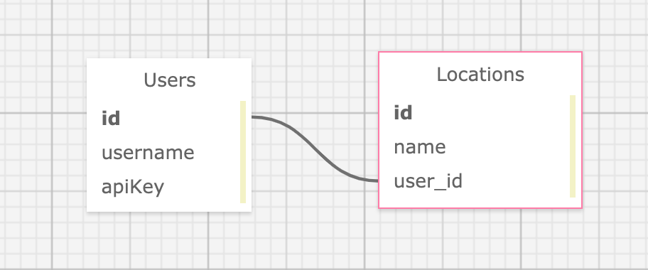

# Sweater Weather (using Express Framework)

Contributor: [Smitha Hosmani](https://github.com/hsmitha26)

## About the Project

A solo project completed in 3 days in Module 4 of Backend Engineering at Turing School of Software and Design.  This was my first attempt at a project in JavaScript.

This app exposes endpoints that return weather forecast for a specific city. It also allows a user to 'favorite' a city and delete a 'favorited' city.  All endpoints require the user to be verified with an API key.

Deployed app: (https://express-weather-forecast.herokuapp.com/)

## Schema


## Tech Stack

* [Express for Node.js](https://expressjs.com/)
* [JavaScript](https://devdocs.io/javascript/)
* [Knex.js](http://knexjs.org/)

## Setup

* `git clone git@github.com:hsmitha26/express-sweater-weather.git`
* `npm install`
* Add `.env` file in the root directory and add your API keys:
  * `GEOCODE_API_KEY=<your Google Geodcode API Key>`
  * `DARKSKY_API_KEY=<your Dark Sky API Key>`

To run the server: `npm start`
* local server: `http://localhost:3000`
* production: `https://express-weather-forecast.herokuapp.com/`

[](https://app.getpostman.com/run-collection/25daa3b4d3b77e758000)

## In Postman, append the url to expose the below endpoints.

### Forecast Data
#### Request:

```
GET /api/v1/forecast?location=denver,co
Content-Type: application/json
Accept: application/json

body:
{
  "api_key": "jgn983hy48thw9begh98h4539h4"
}
```

#### Response (a portion of it):
```
{
  "location": "Denver, C0",
  "currently": {
      "summary": "Overcast",
      "icon": "cloudy",
      "precipIntensity": 0,
      "precipProbability": 0,
      "temperature": 54.91,
      "humidity": 0.65,
      "pressure": 1020.51,
      "windSpeed": 11.91,
      "windGust": 23.39,
      "windBearing": 294,
      "cloudCover": 1,
      "visibility": 9.12,
    },
  "hourly": {
    "summary": "Partly cloudy throughout the day and breezy this evening.",
    "icon": "wind",
    "data": [
      {
      "time": 1555016400,
      "summary": "Overcast",
      "icon": "cloudy",
      "precipIntensity": 0,
      "precipProbability": 0,
      "temperature": 54.9,
      "humidity": 0.65,
      "pressure": 1020.8,
      "windSpeed": 11.3,
      "windGust": 22.64,
      "windBearing": 293,
      "cloudCover": 1,
      "visibility": 9.02,
      },
    ]
  },
  "daily": {
    "summary": "No precipitation throughout the week, with high temperatures bottoming out at 58°F on Monday.",
    "icon": "clear-day",
    "data": [
      {
        "time": 1554966000,
        "summary": "Partly cloudy throughout the day and breezy in the evening.",
        "icon": "wind",
        "sunriseTime": 1554990063,
        "sunsetTime": 1555036947,
        "precipIntensity": 0.0001,
        "precipIntensityMax": 0.0011,
        "precipIntensityMaxTime": 1555045200,
        "precipProbability": 0.11,
        "precipType": "rain",
        "temperatureHigh": 57.07,
        "temperatureLow": 51.47,
        "humidity": 0.66,
        "pressure": 1020.5,
        "windSpeed": 10.94,
        "windGust": 33.93,
        "cloudCover": 0.38,
        "visibility": 9.51,
        "temperatureMin": 53.49,
        "temperatureMax": 58.44,
      },
    ]
  }
}
```

### Favoriting Locations
#### Request:

```
POST /api/v1/favorites
Content-Type: application/json
Accept: application/json

body:

{
  "location": "Denver, CO",
  "api_key": "jgn983hy48thw9begh98h4539h4"
}
```

#### Response:
```
status: 200
body:

{
  "message": "Denver, CO has been added to your favorites",
}
```

### Removing Favorite Locations
#### Request:

```
DELETE /api/v1/favorites
Content-Type: application/json
Accept: application/json

body:

{
  "location": "Denver, CO",
  "api_key": "jgn983hy48thw9begh98h4539h4"
}
```

#### Response:
`status: 204`

### Listing Favorite Locations
#### Request:
```
GET /api/v1/favorites
Content-Type: application/json
Accept: application/json

body:

{
  "api_key": "jgn983hy48thw9begh98h4539h4"
}
```

#### Response (a portion of it):
```
status: 200
body:
[
  {
    "location": "Denver, CO",
    "current_weather": {
      "summary": "Overcast",
      "icon": "cloudy",
      "precipIntensity": 0,
      "precipProbability": 0,
      "temperature": 54.91,
      "humidity": 0.65,
      "pressure": 1020.51,
      "windSpeed": 11.91,
      "windGust": 23.39,
      "windBearing": 294,
      "cloudCover": 1,
      "visibility": 9.12,
    },
    "location": "Golden, CO",
    "current_weather": {
      "summary": "Sunny",
      "icon": "sunny",
      "precipIntensity": 0,
      "precipProbability": 0,
      "temperature": 71.00,
      "humidity": 0.50,
      "pressure": 1015.10,
      "windSpeed": 10.16,
      "windGust": 13.40,
      "windBearing": 200,
      "cloudCover": 0,
      "visibility": 8.11,
    }
  }
]
```
